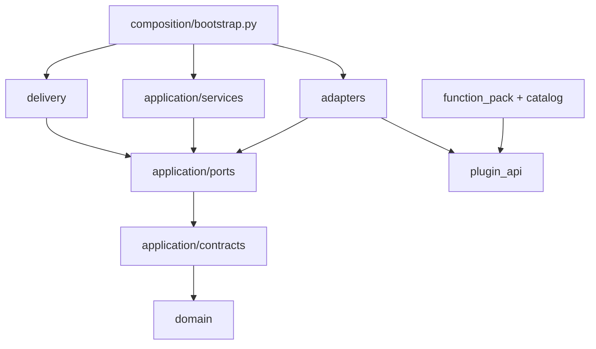

# Architecture example index and walkthrough

> These files are executable architecture documentation. They explain ownership and dependency direction; they are not production implementation templates, starter code, or a compatibility promise.

## Dependency diagram



Dependencies point inward. `composition/bootstrap.py` is the only module that chooses and constructs concrete adapters. The request-scoped workspace is opened and closed there; application services receive protocols only.

## Recommended reading and execution order

1. Read [`../01_system_blueprint.md`](../01_system_blueprint.md), especially sections 5, 6, and 10; view the HTML slides **Clean Architecture** and **Workspace**.
2. Read `domain/`, then `application/contracts/` and `application/ports/` below.
3. Read `plugin_api/`, `catalog/`, `function_pack/`, and `adapters/plugin_mapping/`; pair them with [`../03_plugin_and_catalog_contracts.md`](../03_plugin_and_catalog_contracts.md).
4. Read the graph, orchestration, fan-out, and table examples; pair them with [`../02_processing_model.md`](../02_processing_model.md).
5. Read `delivery/`; pair it with [`../04_delivery_adapters.md`](../04_delivery_adapters.md).
6. Finish with [`pp_fx_architecture_examples/composition/bootstrap.py`](pp_fx_architecture_examples/composition/bootstrap.py) and the end-to-end test.
7. Run focused examples, then the complete documentation contract suite:

```bash
uv run pytest docs/architecture/code_examples/tests/test_composition_walkthrough.py -q
uv run pytest -q
```

The visual companion is [`../../pp_fx_application_overview.html`](../../pp_fx_application_overview.html). Relevant slide names are listed below; the HTML intentionally remains a standalone overview rather than generated API documentation.

## Module-to-document map

### Domain policy

| Example module | Architecture document | HTML overview slide |
|---|---|---|
| `domain/identifiers.py` | Processing model §2 | Plans and requests |
| `domain/units.py` | Processing model §§4, 6–7; plugin contracts §16 | Catalogs and units |
| `domain/scopes.py` | Processing model §§5–8 | Scopes |
| `domain/graph.py` | Processing model §16 | Execution graph |
| `domain/windows.py` | Processing model §§9, 16.2–16.3 | Scopes; Execution graph |
| `domain/results.py` | Processing model §§19–20 | Outcomes |
| `domain/failures.py` | Processing model §20 | Outcomes |

### Application contracts

| Example module | Architecture document | HTML overview slide |
|---|---|---|
| `application/contracts/datasets.py` | Processing model §§3, 14–15 | Plans and requests |
| `application/contracts/tables.py` | System blueprint §§5–6; delivery adapters §11 | Workspace |
| `application/contracts/policies.py` | Processing model §§6–7, 14, 17 | Scopes |
| `application/contracts/requests.py` | Processing model §13 | Plans and requests |
| `application/contracts/plans.py` | Processing model §§10–12, 16.1 | Plans and requests; Execution graph |
| `application/contracts/execution.py` | Processing model §§16.2–16.3 | Execution graph |
| `application/contracts/operations.py` | Processing model §§8, 14, 17–18 | Execution flow |
| `application/contracts/reports.py` | Processing model §§19–20 | Outcomes |
| `application/contracts/providers.py` | Delivery adapters §10 | Workspace |
| `application/contracts/exports.py` | Delivery adapters §12 | Delivery |

### Application ports and services

| Example module | Architecture document | HTML overview slide |
|---|---|---|
| `application/ports/gateways.py` | Delivery adapters §§3–5 | Clean Architecture |
| `application/ports/processing.py` | Delivery adapters §§3, 11 | Execution flow |
| `application/ports/plugins.py` | Delivery adapters §§3, 11 | Plugin authoring |
| `application/ports/providers.py` | Delivery adapters §§3, 10 | Workspace |
| `application/ports/exports.py` | Delivery adapters §§3, 12 | Delivery |
| `application/ports/use_cases.py` | System blueprint §9; delivery adapters §3 | Core promise |
| `application/services/graph_compiler.py` | Processing model §§11–12, 16.1 | Execution graph |
| `application/services/process_dataset.py` | Processing model §18; system blueprint §9 | Execution flow |
| `application/services/occurrence_scheduler.py` | Processing model §§16.2–16.3 | Execution graph |
| `application/services/export_report.py` | Delivery adapters §12 | Delivery |

### Public plugin API, catalogs, and sample pack

| Example module | Architecture document | HTML overview slide |
|---|---|---|
| `plugin_api/references.py` | Plugin contracts §§10–12 | Catalogs and units |
| `plugin_api/units.py` | Plugin contracts §16 | Catalogs and units |
| `plugin_api/contracts.py` | Plugin contracts §§6–9 | Plugin authoring |
| `plugin_api/decorators.py` | Plugin contracts §5 | Plugin authoring |
| `plugin_api/function_pack.py` | Plugin contracts §§3–5, 17 | Plugin authoring |
| `catalog/channels.py` | Plugin contracts §§11–15 | Catalogs and units |
| `catalog/parameters.py` | Plugin contracts §§11–15 | Catalogs and units |
| `function_pack/configuration.py` | Processing model §10; plugin contracts §9 | Plugin authoring |
| `function_pack/derived_channels.py` | Plugin contracts §6 | Plugin authoring |
| `function_pack/window_detectors.py` | Plugin contracts §6; processing model §9 | Plugin authoring |
| `function_pack/kpis.py` | Plugin contracts §6 | Plugin authoring |
| `function_pack/metrics.py` | Plugin contracts §6 | Plugin authoring |
| `function_pack/pack.py` | Plugin contracts §§3–5 | Plugin authoring |

### Driven adapters

| Example module | Architecture document | HTML overview slide |
|---|---|---|
| `adapters/fakes.py` | System blueprint §11; roadmap §16 | Clean Architecture |
| `adapters/recording.py` | Processing model §18; roadmap §16 | Execution flow |
| `adapters/plugin_mapping/catalog.py` | Plugin contracts §§10–16 | Catalogs and units |
| `adapters/plugin_mapping/validation.py` | Plugin contracts §§9–10, 16–18 | Catalogs and units |
| `adapters/plugin_mapping/mapper.py` | Plugin contracts §§9–10, 17 | Plugin authoring |
| `adapters/plugin_mapping/registry.py` | Processing model §11; plugin contracts §§4, 17 | Plugin authoring |
| `adapters/pandas_tables/workspace.py` | System blueprint §10; delivery adapters §11 | Workspace |
| `adapters/pandas_tables/gateway.py` | Delivery adapters §§4–5, 11 | Execution flow |
| `adapters/pandas_tables/processing.py` | Processing model §§5, 14; delivery adapters §11 | Execution flow |
| `adapters/pandas_tables/plugins.py` | Plugin contracts §8; delivery adapters §11 | Plugin authoring |

### Driving delivery adapters

| Example module | Architecture document | HTML overview slide |
|---|---|---|
| `delivery/request_dtos.py` | Delivery adapters §§6–9 | Delivery |
| `delivery/request_mapping.py` | Delivery adapters §§6–9, 13–14 | Delivery |
| `delivery/python_facade.py` | Delivery adapters §6 | Delivery |
| `delivery/outcome_mapping.py` | Delivery adapters §§9, 12–13 | Delivery; Outcomes |

### Composition root

| Example module | Architecture document | HTML overview slide |
|---|---|---|
| `composition/bootstrap.py` | System blueprint §10; processing model §18 | Clean Architecture; Execution flow |

## End-to-end code path

The walkthrough intentionally uses one fixed frame and a canned scalar result. No calculation is hidden in composition.

```text
composition.bootstrap
  1. opens PandasTableWorkspace                         [composition/adapter]
  2. constructs repositories, gateways, registry       [driven adapters]
  3. injects protocols into ProcessDatasetService       [application]
  4. creates PythonRequestBuilder + facade              [delivery]

PythonProcessInput
  → PythonProcessingFacade                              [delivery]
  → ProcessingRequest                                   [application contract]
  → ProcessDatasetService                               [application service]
  → plan/dataset/parameter/preparation/plugin ports     [application ports]
  → fake/example adapters + exact callable registry     [adapters]
  → ArtifactResult → ExecutionReport                    [domain/application]
  → ExecutionCompleted                                  [application outcome]
  → workspace disposal                                  [composition]
```

The rejection walkthrough changes only the public target ID. The facade still maps the request, but `ProcessDatasetService` returns `RequestRejected(UNKNOWN_TARGET)` immediately after plan lookup; no dataset, parameter, preparation, or plugin adapter runs.

## Deliberate limits

No production module imports this package. The walkthrough performs no real KPI calculation, IO, package discovery, persistence, export, CLI handling, gRPC handling, concurrency, streaming, deployment setup, or global dependency-container registration.
